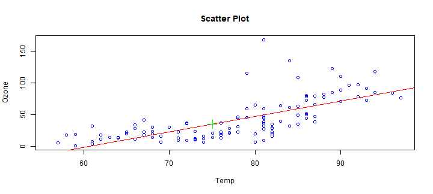

## What does this app do?

1. This app allows you to predict the NY Ozone level using simple linear regression models.
2. For this purpose, the user can select one out of three different climate variables as a predictor and enter its value
3. The user will get a prediction for the Ozone level as well as a plot of the regression line and
a table with the linear regression coefficients

--- .class #id 

## Air Quality Data

The airquality dataset includes Daily air quality measurements in New York, from May to September 1973.
Lets take a look at it.


```r
data("airquality")
head(airquality)
```

```
##   Ozone Solar.R Wind Temp Month Day
## 1    41     190  7.4   67     5   1
## 2    36     118  8.0   72     5   2
## 3    12     149 12.6   74     5   3
## 4    18     313 11.5   62     5   4
## 5    NA      NA 14.3   56     5   5
## 6    28      NA 14.9   66     5   6
```

--- .class #id 

## Selecting Inputs

The user will have to select one of the three available variables to predict the Ozone level and enter
its numeric value:

1. Temperature
2. Solar Radiation
3. Wind velocity

--- .class #id 

## Outputs

The user will get the prediction of the Ozone value, a table with the regression coefficients and a plot
with the regression line and the predicted value as it is shown in the following example


```r
data("airquality"); fit <- lm(Ozone~Temp, data = airquality); newdata <- data.frame(Temp = 75)
plot(airquality$Temp, airquality$Ozone, xlab="Temp", ylab="Ozone", col='blue',main='Scatter Plot')
abline(fit, col = "red"); points(newdata, predict(fit, newdata), col= "green", pch = 3, cex = 2)
```




